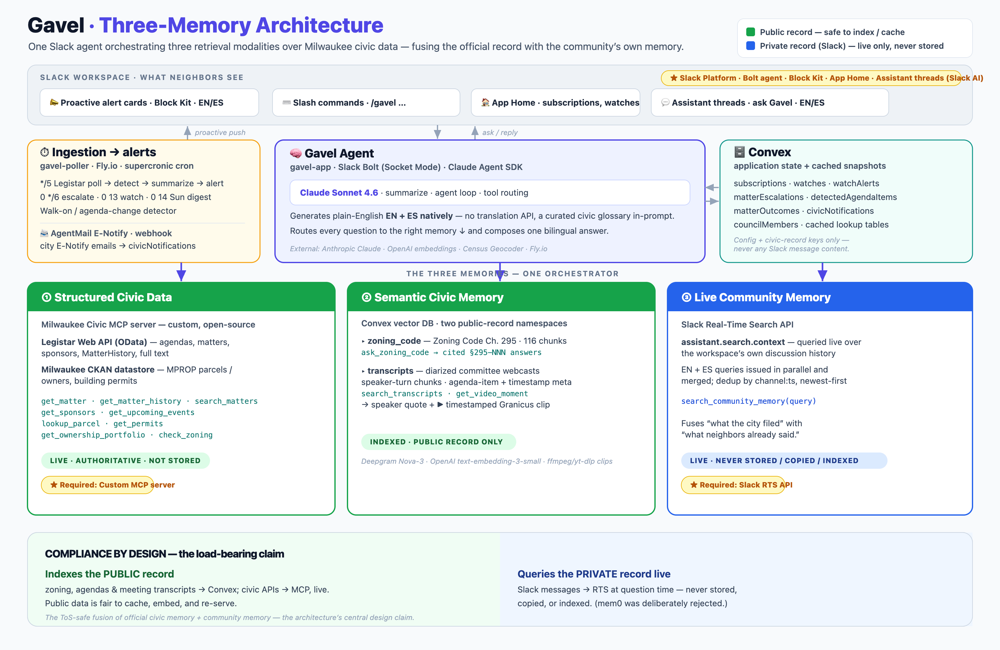

# Gavel

> A proactive Slack agent that watches Milwaukee city government and tells your neighborhood what's about to be decided — **before the vote** — in plain English and Spanish.

It is not a chatbot. Nobody asks it anything. It reads the city's agenda system on a cron and shows up on its own.

> 🏛️ **Slack Agent Builder Challenge** · *Agent for Good* track · built by **Tarik Moody**, who sits on Milwaukee's City Plan Commission.
> ✅ **Status: shipped.** Deployed on Fly.io, 927 tests passing, running live against Milwaukee's real civic data.

**▶ Demo video:** _add YouTube link_ · **Devpost:** _add link_

---

## The problem, in one true story

This spring a data center was headed for a vacant Walmart at 5825 W Hope Ave, next to people's houses. The city's own filing never used the words "data center." It called it a **"computational research facility."**

The neighborhood worked it out anyway. They packed a seven-hour hearing and sent more than 270 letters. In July the developer dropped the data center. **They won.**

But look at what winning cost: a handful of residents teaching themselves to read municipal zoning code, on their own time, after work. Milwaukee published every fact about that project, on time, in full — and it still took all that for anyone to find out. Most blocks don't have those people. Most blocks find out after the vote.

**"Public" and "readable" are different words.** Gavel is the gap between them.

## What it does

- **Posts unprompted.** Watches Milwaukee's Legistar agenda system every five minutes. When something lands that touches your block, it posts a Block Kit card: what it is, why it matters, when the hearing is, how to speak at it — plus the local reporting on the same card.
- **Speaks Spanish natively.** No translation API. Claude writes the Spanish directly with a civic glossary in the prompt, and both languages sit on one card. Translated civic English reads like translated civic English.
- **Knows what your neighborhood already said.** Ask *"didn't we already push back on this?"* and it answers with the official record **and** your community's own words — queried live from your Slack history, and never stored.
- **Makes the spoken record searchable.** Milwaukee publishes meeting *video*, not transcripts. Gavel transcribes hearings (Deepgram, diarized) so you can ask what the commission actually *said*, and clips the moment.
- **Closes the loop.** It drafts your public comment in your position and your words, ready to file before the hearing. You edit it. You send it. A human is always in the loop.

## Architecture — the three-memory model



One agent, three retrieval modalities that cannot be the same kind of memory. The split is also the **compliance design**:

> **Gavel indexes the public record and queries the private record live.**

| # | Memory | What it is | Storage |
|---|---|---|---|
| 1 | **Structured civic data** | Custom **Milwaukee Civic MCP server** wrapping Legistar (OData) + Milwaukee's open property, permit, and zoning data | Live API, cached lookups |
| 2 | **Semantic civic memory** | Convex vector DB, two namespaces (`zoning_code`, `transcripts`) with different chunking strategies | Indexed — **public record only** |
| 3 | **Live community memory** | Slack **Real-Time Search API** (`assistant.search.context`) over the workspace's own history | **Never stored.** Queried live, kept nothing |

Take Real-Time Search away and Gavel either goes deaf to its own neighborhood, or it starts warehousing people's messages. That's not a feature bolted on — it's why the architecture is shaped like this.

## Sponsor technologies — all three, verifiable

| Requirement | Where it lives |
|---|---|
| **Real-Time Search API** | [`agent/agent/community-memory/rts-client.js`](agent/agent/community-memory/rts-client.js) calls `assistant.search.context` |
| **MCP server integration** | [`buildAgentOptions()`](agent/agent/agent.js) registers **three** servers — see below |
| **Slack AI / agent surface** | `assistant_thread_started` + `setSuggestedPrompts`, `setStatus` (visible tool trace), `sayStream` (streamed answers), `app_mention`, reply-in-thread |

**Three MCP servers, one of which we wrote:**

- **`milwaukee-civic`** — [`mcp-server/`](mcp-server/) — **our own MCP server**, not one we consumed. Wraps Legistar plus Milwaukee's property/permit/zoning data. Open source, parameterized by city, so it works for the ~**300 municipalities running Legistar**. This is the piece that outlives the hackathon.
- **`community-memory`** — an SDK MCP server wrapping the RTS call above as an agent tool.
- **`slack-mcp`** — Slack's hosted MCP server (HTTP), the fallback search path when RTS is unavailable.

## Tech stack

| Layer | Technology |
|-------|------------|
| Language | JavaScript / TypeScript (Node.js 20+) |
| Agent runtime | Slack **Bolt for JavaScript**, Socket Mode |
| Model | **Claude** via the Claude Agent SDK (summarizing, bilingual generation, tool routing, comment drafting) |
| State + vector search | **Convex** (subscriptions, watchlists, channel prefs, two vector namespaces) |
| Civic data | Custom **Milwaukee Civic MCP** server — Legistar OData + Milwaukee CKAN |
| Live workspace memory | Slack **Real-Time Search API** |
| Hosting | **Fly.io** (`gavel-app` agent + `gavel-poller` cron) |
| Transcription | **Deepgram Nova-3** (batch, diarized) |
| Media | ffmpeg / yt-dlp (video clipping) |
| Geocoding | Census Geocoder |
| Demo pipeline | ElevenLabs (VO) · Playwright (live capture) · HyperFrames (assembly) |

## Try it — the 60-second path

Every answer below is generated live. Nothing is canned.

1. **See the alert nobody asked for.** Open `#general`. Gavel posted a bilingual card about a real item on the **July 20 City Plan Commission** agenda (File #260030).
2. **Ask the question that shows what's different.** Reply in that card's thread:
   > *Didn't we already push back on this?*

   It answers with the official record **and** what the neighborhood already said, via Real-Time Search.
3. **Ask who's behind it.** `Who owns 5825 W Hope Ave?` → **AFS Milwaukee LLC**, from the city property record.
4. **Ask what they *said*.** `What did the Plan Commission actually call it on June 29?` → it searches its transcript of the hearing.
5. **Act.** Hit ✍️ **Make my voice heard** → Gavel drafts your public comment; you edit and send it.
   🧪 *Demo mode: it goes to a test inbox, never a real city clerk.*

You can also DM Gavel, `@mention` it anywhere, or open it in the sidebar — the **App Home** has a test script at the top, and the assistant thread opens with four one-click prompts.

## Quick start (local)

### Prerequisites

- **Node.js 20+**
- A **Slack developer sandbox** ([Slack Developer Program](https://api.slack.com/developer-program))
- An **Anthropic API key** ([console.anthropic.com](https://console.anthropic.com))

```bash
git clone https://github.com/tmoody1973/gavel-slack-agent.git
cd gavel-slack-agent/agent

npm install
cp .env.sample .env     # add your ANTHROPIC_API_KEY

slack login
slack run               # installs to the sandbox + starts Socket Mode
```

### Commands

```bash
node --test                      # 927 tests
npx @biomejs/biome check .       # lint
npx convex dev                   # Convex codegen / push
node scripts/rts-smoke.mjs "neighborhood"   # verify Real-Time Search end to end
```

### Deploy

Two Fly apps, two configs. **`-a` does not select the config file — the working directory's `fly.toml` does**, so deploying the agent from `agent/` would silently ship the *poller* config instead:

```bash
fly deploy -c fly.app.toml --remote-only    # gavel-app (the Bolt agent) — from repo ROOT
cd agent && fly deploy --remote-only        # gavel-poller (the cron)
```

Verify with `fly logs`, not machine state: a healthy agent logs `Gavel is running!`.

## Environment variables

Set in `agent/.env` (gitignored, never committed):

| Variable | Description | Required |
|----------|-------------|----------|
| `ANTHROPIC_API_KEY` | Powers summarizing, bilingual generation, and the agent loop | **Yes** |
| `SLACK_BOT_TOKEN` / `SLACK_APP_TOKEN` | Socket Mode, when running without the Slack CLI | For deploy |
| `SLACK_USER_TOKEN` | `xoxp-` token with `search:read.public` — **required for Real-Time Search** | For RTS |
| `CONVEX_URL` | Convex deployment (state + vector search) | **Yes** |
| `DEEPGRAM_API_KEY` | Meeting transcription | For transcripts |

## Repository structure

```
gavel-slack-agent/
├── agent/              # The Slack agent (Bolt + Claude Agent SDK)
│   ├── listeners/      #   events / actions / views — the agent surface
│   ├── agent/          #   Claude Agent SDK reasoning loop + MCP wiring
│   │   └── community-memory/  # Real-Time Search client (never persists)
│   ├── alerts/         #   Block Kit alert cards (bilingual)
│   ├── civicmail/      #   public-comment drafting + filing
│   ├── transcripts/    #   Deepgram ingest, vector search, video clipping
│   └── convex/         #   schema, subscriptions, watchlists, vectors
├── mcp-server/         # ⭐ Milwaukee Civic MCP server (open source, any Legistar city)
├── demo-video/         # VO + Playwright capture + HyperFrames assembly pipeline
├── docs/               # PRD, Legistar data reference, personas, architecture
└── CLAUDE.md           # How this project is built
```

## Known limits, stated plainly

- **Granicus blocks our cloud host's IP for media.** The video clipper works and is tested, but from Fly it can't fetch the webcast — so it degrades honestly to a timestamped deep link into the city's own player. The demo video says so out loud.
- **Legistar has no geocoded fields anywhere.** Addresses are extracted from title prose by Claude and resolved via the Census geocoder.
- **Topic tags are applied only at enactment**, which is exactly too late for an agent whose job is warning you beforehand. So topic classification is custom.
- **Not yet proven in the field.** This is a working, deployed agent — not an intervention that has sat in a real neighborhood association for a year.

## License

The agent scaffold is MIT (from [slack-samples](https://github.com/slack-samples)). **The Milwaukee Civic MCP server ships open source** for reuse across the 300+ Legistar municipalities.
